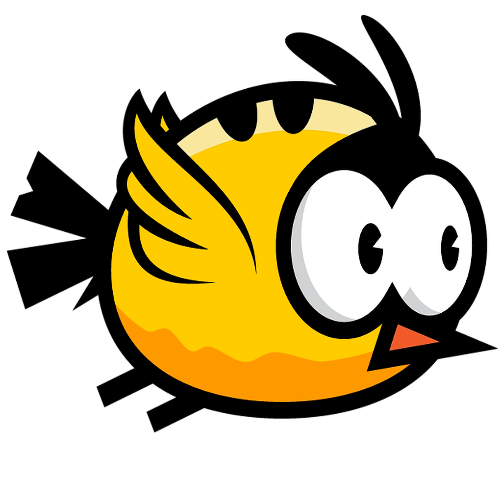
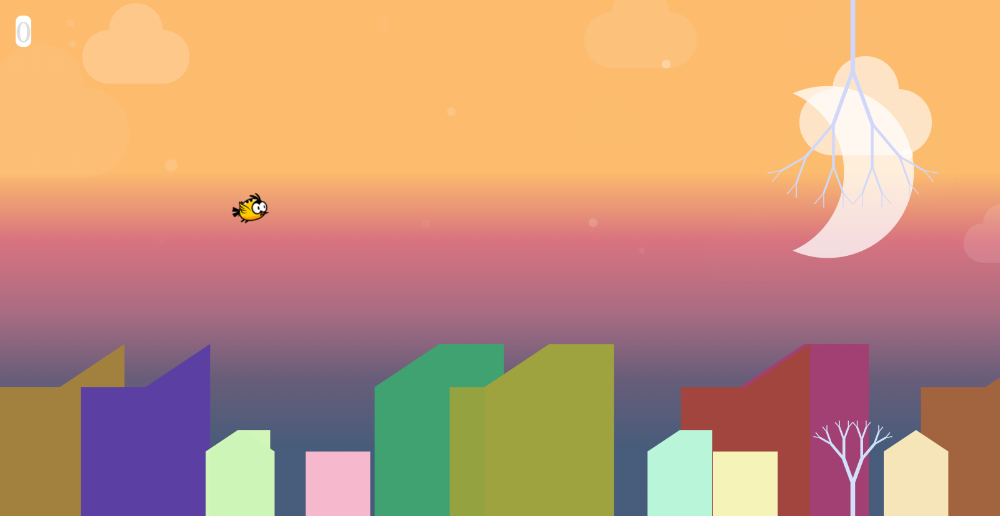

# flappingBird

FlappingBird is a Mobile side scroller game where the player controls a bird, attempting to fly between columns trees without hitting them

# Installation
	- FlappingBird is available as a standalone Android app
	- FlappingBird is also as an offline Progressive Web App
	- You can always play FlappingBird from your browser
# Controls
	- Tap Touchscreen
	- Press Space
# Gameplay
FlappingBird is a single player arcade-style game in which the player controls the bird, which moves persistently to the right. The player is tasked with navigating the bird through pairs of trees that have equally sized gaps placed at random heights. the bird automatically gravitates and only ascends when the player taps the touchscreen or spacebar. Each successful pass through a pair of trees awards the player one point. Colliding with a tree or the ground ends the gameplay. If a player successfully sneaks through the bark beneath the branches is awarded a bonus point and a barrel roll 360° Clockwise Spinning animation!